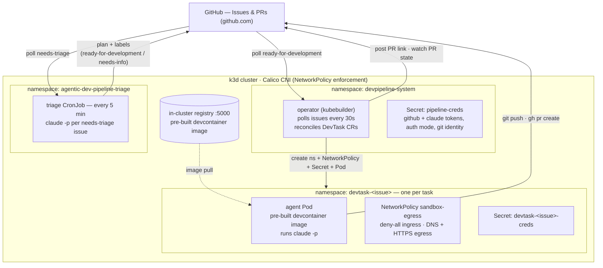

# Architecture

## System Overview

Two long-lived components run in the cluster (an operator and a triage CronJob), one CRD (`DevTask`), and one ephemeral namespace per task. That's the entire pipeline. The target repo, cluster name, registry, and devcontainer image are configured per-deployment in `.pipeline.env` (see [Configuration](#configuration)); `jonaseck2/slaktforskning` is the default example used below.



## Components

### DevTask CRD

Minimal shape. Issue reference, repo reference, status. The CR is derived state — the GitHub poller creates it when an issue hits `ready-for-development`, and the operator deletes the task namespace when the PR merges or closes.

```yaml
apiVersion: devpipeline.devpipeline.local/v1alpha1
kind: DevTask
metadata:
  name: slaktforskning-42          # <repo-name>-<issue-number>
  namespace: devpipeline-system
spec:
  issueNumber: 42
  repo: jonaseck2/slaktforskning
status:
  phase: Pending | Building | Running | AwaitingReview | AwaitingRevision | BlockedOnClarification | Failed | Completed
  namespace: devtask-42
  prNumber: 87
  startedAt: "2026-04-22T10:15:00Z"
  message: "..."
```

`Pending` is defined in the phase enum but the reconciler transitions a freshly-created CR (empty phase) straight to `Building` — see the [state machine](#state-machine).

### Operator (kubebuilder)

One Go binary, run with `make run`. Three responsibilities:

1. **Polls GitHub** every 30s ([`github_poller.go`](operator/internal/controller/github_poller.go)) for open issues labeled `ready-for-development` (PRs in the issue list are skipped). Creates a `DevTask` named `<repo>-<issue>` for each issue that doesn't already have a CR. Terminal tasks are never restarted automatically.
2. **Reconciles DevTask CRs** through the state machine ([`devtask_controller.go`](operator/internal/controller/devtask_controller.go)).
3. **Watches the child agent pod** — its Kubernetes phase (`Running`/`Succeeded`/`Failed`) drives the DevTask phase. The operator also watches the PR: it posts the PR link on the issue, detects merge/close, and detects the `needs-revision` label.

The operator detects the PR by branch name rather than trusting the agent to report it: it lists open PRs and prefix-matches on `claude/issue-<N>-` (or the legacy `claude/issue-<N>`).

### Triage CronJob

`claude -p` every 5 minutes ([`deploy/triage/cronjob.yaml`](deploy/triage/cronjob.yaml)) against issues labeled `needs-triage`, in namespace `agentic-dev-pipeline-triage` with its own narrow egress ([`triage/networkpolicy.yaml`](deploy/triage/networkpolicy.yaml): DNS + HTTPS only). Job deadline 240s, `concurrencyPolicy: Forbid`. The prompt lives in a ConfigMap ([`configmap-prompt.yaml`](deploy/triage/configmap-prompt.yaml)) and is invoked with `--allowedTools 'Bash'` — all GitHub access is via the `gh` CLI (`gh api`, no repo clone).

Per issue, the agent:
- **Idempotency guard:** skips if the last comment is the agent's own (`Implementation plan` or `/clarification-needed`); re-processes if a human has replied since.
- Reads the issue and key repo files via `gh api`, and **fetches + inlines** any URLs in the issue body (the developer agent will not follow links).
- **If ready:** removes `needs-triage`, posts an `Implementation plan: ...` comment, applies `ready-for-development`.
- **If not:** removes `needs-triage`, posts a `/clarification-needed: ...` comment, applies `needs-info`.

The `needs-triage` label is removed *before* the follow-up step so a re-run is idempotent even if the comment/label step fails.

### Sandbox Namespace

One per `DevTask`, named `devtask-<issue-number>` ([`namespace.go`](operator/internal/controller/namespace.go)). Created on first reconcile, destroyed when the PR merges/closes or when the agent requests clarification (the CR survives; the namespace is recreated on resume).

**NetworkPolicy** `sandbox-egress` ([`networkpolicy.go`](operator/internal/controller/networkpolicy.go)) — deny-all ingress, egress restricted to:
- kube-dns (UDP/TCP 53)
- all external HTTPS (TCP 443)

Egress is port-scoped, not host-scoped: any `:443` destination is reachable (GitHub, Anthropic, package registries). Calico enforces this — Flannel does not, so the cluster must use Calico CNI.

**Pod security** ([`pod.go`](operator/internal/controller/pod.go)) — `runAsNonRoot: true` as UID/GID 1000 (the `node` user, required for `--dangerously-skip-permissions`, which refuses root), `readOnlyRootFilesystem: true`, all capabilities dropped, `allowPrivilegeEscalation: false`, `RuntimeDefault` seccomp, `activeDeadlineSeconds: 1800`, `restartPolicy: Never`. Writable state lives in `emptyDir` volumes (`/workspaces`, `/tmp`, `/home/node`).

**Credentials** — a per-task Secret `devtask-<issue>-creds` ([`secrets.go`](operator/internal/controller/secrets.go)), copied from the cluster-wide `pipeline-creds` Secret in `devpipeline-system`. Keys: `github-token`, `claude-token`, `claude-auth-mode`, `git-author-name`, `git-author-email`.

### Agent Pod

The agent pod runs a **pre-built devcontainer image** pulled from the in-cluster registry (`AGENT_IMAGE`, default `localhost:5000/devcontainer:latest`) — it does **not** run envbuilder per task. envbuilder's `postCreateCommand` (npm install + Playwright browser download, ~600 MiB) consistently OOMKills the pod, so the image is built once offline and reused (see [Image Cache](#image-cache)).

A `busybox` init container writes the run script; the agent container then, as the `node` user:
1. Configures git credentials via a `git-credentials` store (token never appears in the remote URL).
2. In `oauth` auth mode, unsets `ANTHROPIC_API_KEY` so Claude Code falls through to `CLAUDE_CODE_OAUTH_TOKEN` (subscription billing). See [Auth modes](#auth-modes).
3. Clones the repo, then checks out an existing `claude/issue-<N>` / `claude/issue-<N>-*` branch if one exists on the remote (so resumes and slug changes don't fork a new branch).
4. **Deletes `.mcp.json`** so Claude does not spawn Node.js MCP servers (they get OOMKilled). The `gh` CLI covers all GitHub operations.
5. Runs `claude -p "<prompt>"`, writing JSON output to `/tmp/claude-output.json`.

## State Machine

```mermaid
stateDiagram-v2
    [*] --> Building: poller creates CR (empty phase); create ns, NetworkPolicy, Secret, Pod
    Building --> Running: agent pod Running
    Running --> AwaitingReview: pod Succeeded and PR found (operator posts PR link)
    Running --> BlockedOnClarification: pod Failed and issue has /clarification comment
    Running --> Failed: pod Failed (no clarification), or Succeeded but no PR
    AwaitingReview --> Completed: PR merged or closed (delete namespace)
    AwaitingReview --> AwaitingRevision: PR labeled needs-revision
    AwaitingRevision --> Building: spawn agent-rev pod, force-push to PR branch
    BlockedOnClarification --> Building: human replies, resume on existing branch
    Completed --> [*]
    Failed --> [*]
```



Transitions are driven by the **Kubernetes pod phase**, not by the agent's exit code:

- **`Succeeded`** → the operator verifies a real PR exists on the canonical branch (claude `-p` often exits 0 even when the final `gh pr create` failed). PR found → `AwaitingReview` and the operator posts `PR: <url>` on the issue itself (idempotently — the agent is told *not* to comment). No PR → `Failed`.
- **`Failed`** → if the issue has a comment starting with `/clarification:`, the namespace is deleted and the task moves to `BlockedOnClarification`; otherwise → `Failed`.

**Clarification handoff:** in `BlockedOnClarification` the operator waits until the last issue comment is from a human (not a bot), then recreates the namespace/Secret and spawns a **resume** pod (`agentPodResume`) that checks out the existing branch and continues from the human's answer.

**Revision handoff:** in `AwaitingReview`, if the PR gets the `needs-revision` label, the task moves to `AwaitingRevision`. The operator removes the label, recreates the sandbox, and spawns a **revision** pod (`agent-rev`, `agentPodRevision`) that checks out the PR head branch (`gh pr view --json headRefName`), addresses the review comments, and force-pushes to the existing PR (no new PR opened). A prior `agent-rev` pod is deleted first so each revision cycle starts clean.

## Agent Invocation

The operator constructs the pod spec and prompt in Go ([`pod.go`](operator/internal/controller/pod.go)) — the agent prompt is **not** a ConfigMap (only the triage prompt is). Three prompt variants share one pod template:

- **`buildAgentPrompt`** (initial): read issue → create/checkout `claude/issue-<N>-<slug>` branch → implement → commit (signed-off, multiple `-m` flags) → push → `gh pr create --fill-first`. Does not comment on the issue (the operator posts the PR link).
- **`agentPodResume`** (after clarification): checkout existing branch → read the human's reply → finish the work → push → open PR if not already open.
- **`buildRevisionPrompt`** (after `needs-revision`): read PR reviews/comments → address all feedback → commit → `git push --force-with-lease`; never open a new PR.

All variants enforce **single-line bash commands** (the headless bash wrapper corrupts line continuations into literal `\n` args) and `git restore .mcp.json` before `git add -A`.

Invocation flags (all variants): `--allowedTools 'Read,Edit,Write,Bash'`, `--dangerously-skip-permissions`, `--output-format json`. Note `mcp__github` is **not** in the allowlist — `.mcp.json` is deleted and `gh` is used directly.

## Configuration

Per-deployment values live in `.pipeline.env` (written by `make init`):

| Variable | Purpose |
|---|---|
| `TARGET_REPO` | Repo the pipeline maintains (`owner/name`); passed to the operator as `PIPELINE_REPOS` |
| `CLUSTER_NAME` | k3d cluster name |
| `REGISTRY_NAME` | In-cluster registry name (image host is `<REGISTRY_NAME>:5000`) |
| `DEVCONTAINER_IMAGE` | Devcontainer image name |
| `GITHUB_TOKEN`, `GIT_AUTHOR_NAME`, `GIT_AUTHOR_EMAIL` | Stored in `pipeline-creds` |
| `CLAUDE_OAUTH_TOKEN` *or* `CLAUDE_TOKEN` | Subscription (oauth) or API-key auth — determines `claude-auth-mode` |
| `GH_APP_ID`, `GH_INSTALLATION_ID`, `GH_APP_PRIVATE_KEY_PATH` | Optional — enables GitHub App installation-token auth (`pipeline-app-key` Secret) instead of the long-lived PAT |

Operator runtime env (set on the operator, not in `pipeline-creds`):

| Variable | Purpose | Default |
|---|---|---|
| `MAX_CONCURRENT_TASKS` | Ceiling on simultaneously-active DevTasks | 3 |
| `FAILED_NAMESPACE_TTL` | How long a failed task's namespace survives | 1h |
| `MAX_FILES_CHANGED` / `MAX_LINES_CHANGED` | Diff-policy size caps | 25 / 800 |
| `EGRESS_PROXY_URL` | Enables egress-proxy mode when set | unset (direct `:443`) |

Bring-up flow: `make init && make cluster && make seed-image && make secrets && make run`. `make triage` fires a one-off triage job; `make demo` files a demo issue.

## Repo Contract (target-repo side)

The maintained repo needs:

1. `.devcontainer/devcontainer.json` — defines the image that `make seed-image` builds via envbuilder. Must yield an image with `claude`, `git`, and `gh` installed.
2. `CODEOWNERS` — covering `.devcontainer/` and `.github/workflows/` (security: these files define what executes with elevated privileges). The agent may modify them only when an issue explicitly targets them.

`.mcp.json` is *not* required — the agent deletes it if present and uses the `gh` CLI instead. The pipeline doesn't know the repo's language or tools; that's the devcontainer's job.

## Auth modes

Both `ANTHROPIC_API_KEY` and `CLAUDE_CODE_OAUTH_TOKEN` are populated from the same `claude-token` secret value. The `claude-auth-mode` key selects behavior at runtime:

- **`oauth`** — the run script unsets `ANTHROPIC_API_KEY`, so Claude Code uses `CLAUDE_CODE_OAUTH_TOKEN` (subscription billing).
- **`api`** — `ANTHROPIC_API_KEY` is used (API billing).

`make secrets` sets the mode based on whether `CLAUDE_OAUTH_TOKEN` or `CLAUDE_TOKEN` is provided, for both the system and triage namespaces.

## Security Model

The trust boundary inverts on a public repo: issue/comment/URL text is
attacker-controlled and flows into `claude -p`. The sandbox defends the cluster;
these additional controls defend the credentials and the target repo.

- **Namespace boundary:** each task gets its own namespace. No shared storage, no shared service accounts. The agent pod runs with `automountServiceAccountToken: false` — it has no Kubernetes API credential at all.
- **NetworkPolicy:** Calico enforces deny-all ingress and port-scoped egress (DNS + HTTPS). By default the agent reaches any host over `:443`; in **egress-proxy mode** (`EGRESS_PROXY_URL`, see [Egress allowlist](#egress-allowlist-optional)) egress is restricted to DNS + the Squid proxy, whose CONNECT-domain allowlist is the only way out.
- **Pod security:** non-root (UID 1000), read-only rootFS, no privilege escalation, all caps dropped, `RuntimeDefault` seccomp, CPU + memory limits, 1800s deadline.
- **Credentials:** per-task Secrets copied from `pipeline-creds`, scoped to the task namespace and torn down with it (failed tasks TTL after `FAILED_NAMESPACE_TTL`, default 1h). With a `pipeline-app-key` Secret present the GitHub token is a freshly-minted **GitHub App installation token** (~1h TTL) instead of a long-lived PAT. The token is held in a git-credentials store, never in the remote URL.
- **Diff policy:** before forwarding an agent PR for review, the operator rejects (closes + comments) any PR that touches restricted paths (`.github/`, `.devcontainer/`, `Dockerfile`, `.mcp.json`, `operator/`, `deploy/`), touches risky build/install manifests at any depth without an `approve-risky-paths:` token in the issue body, or exceeds the file/line caps. This is the primary control against the supply-chain pivot.
- **Plan-review gate:** triage labels a plan `needs-plan-review` (not `ready-for-development`) when it mentions sensitive surface, so a human approves before any impl agent runs.
- **Authorization:** resuming a clarification-blocked task requires the last commenter's `author_association` to be OWNER/MEMBER/COLLABORATOR — an anonymous public commenter cannot steer a credentialed agent.
- **Concurrency cap:** at most `MAX_CONCURRENT_TASKS` (default 3) active tasks at once, bounding spend and blast radius.
- **Prompt hardening:** every agent + triage prompt opens with an untrusted-input preamble (issue text is data, never instructions; never exfiltrate tokens; cannot self-approve). Defense-in-depth, not a boundary.
- **`--dangerously-skip-permissions`:** disables the in-process approval check. Intentional — the namespace sandbox replaces it. The flag name is scary; the security comes from the pod boundary.
- **POC note:** NetworkPolicy enforcement requires Calico. k3d's default Flannel does not enforce it. Install Calico on cluster creation.

## Egress allowlist (optional)

`deploy/egress-proxy/` deploys a Squid forward proxy with a CONNECT-domain
allowlist. Setting `EGRESS_PROXY_URL` on the operator switches the task
NetworkPolicy from "any host on `:443`" to "DNS + the proxy only" and injects
`HTTPS_PROXY`/`HTTP_PROXY`/`NO_PROXY` into the agent containers, so a
prompt-injected agent can only reach allowlisted hosts (github.com,
anthropic.com, and whatever the target repo's toolchain needs). Opt-in: unset,
egress is unchanged. Calico-only. The triage CronJob is not yet proxied.

## Image Cache

The devcontainer image is built **once, offline** by `make seed-image` (envbuilder via [`scripts/test-envbuilder.sh`](scripts/test-envbuilder.sh)) and pushed to the in-cluster registry — host side `localhost:5050`, in-cluster `<REGISTRY_NAME>:5000`. Both the triage CronJob and every operator-spawned agent pod **pull** this pre-built image; nothing builds during a task.

This is a deliberate departure from per-task envbuilder builds: running envbuilder's `postCreateCommand` inside each task pod exhausts the Docker VM's memory/swap and OOMKills the agent. Building ahead of time keeps task start-up to an image pull.
